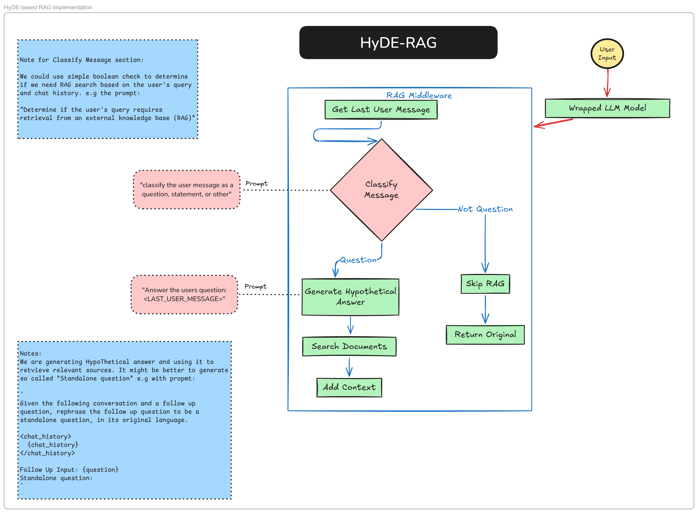
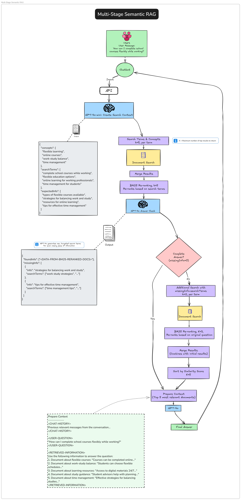

# GAIK Application

A modern web application for conversational AI, document management, and analytics, powered by RAG (Retrieval Augmented Generation) capabilities and built with Next.js 15.2 and React 19.

## Quick Start

The easiest way to get started is using the guest mode:

> **Note**: If you don't have pnpm installed, you can download it from https://pnpm.io/

```bash
# Install dependencies
pnpm install

# Run the setup script
pnpm app:setup
# Choose option 1 for easy setup

# Start the development server
pnpm dev
```

> **Note**: You can also use `npm` for all commands by replacing `pnpm` with `npm run` (e.g., `npm run app:setup` instead of `pnpm app:setup`).

Then navigate to [http://localhost:3000](http://localhost:3000) and click "Continue as Guest" on the login page.

You can access the chatbot directly at [http://localhost:3000/chatbot](http://localhost:3000/chatbot).

## Application Architecture

```mermaid
graph TB
    subgraph "Next.js"
        A[UI Components]
        U[Server Actions & API]
    end

    subgraph "Authentication"
        C[Supabase Auth]
        D[JWT Tokens]
        E[Guest Mode]
    end

    subgraph "AI Integration"
        F[Vercel AI SDK]
        G[OpenAI Models]
        H[Streaming Responses]
        I[Structured Outputs]
    end

    subgraph "RAG System"
        Z1[RAG Middleware]
        Z2[Embeddings Generation]
        Z3[Vector Similarity Search]
        J[Document Processing]
    end

    subgraph "Data Management"
        N[Drizzle ORM]
        O["Supabase (PostgreSQL)"]
        P[Database Migrations]
    end

    subgraph "Storage"
        R[CSC Allas S3 Bucket]
    end

    subgraph "Communication"
        S[Resend Email]
        T[Invitation System]
    end

    A <--> C
    A <--> E
    A <--> U
    C <--> D
    F <--> G
    F <--> H
    F <--> I

    %% RAG System Flow
    Z1 --> Z2
    Z2 --> Z3
    J --> Z3
    Z3 --> Z1
    Z1 --> F

    %% Storage Flow
    U <--> R

    %% Data Management
    N <--> O
    N --> P

    %% Server Features
    S --> T
    T <--> A
    U <--> N
    U <--> F
    U <--> S
    U <--> Z1

    %% Data Flow
    O --> Z3
```

## Technology Stack

### Core Framework

- **Next.js 15.2**: Full-stack meta-framework that combines Node.js and React, featuring server components, server actions, and integrated API routes
- **React 19**: Latest version of React with advanced features and performance improvements
- **shadcn/ui**: Component library for building the application interface
- **Vercel AI SDK**: Core toolkit for integrating AI capabilities, streaming responses, and building AI-powered applications

### Authentication

- **Supabase Auth**: User authentication with JWT tokens
- **Guest Mode**: Allow users to access features without authentication

### Database (Supabase) & ORM

- **PostgreSQL/Supabase**: Database for user data and vector embeddings
- **Drizzle ORM**: Type-safe ORM for database operations
- **PgVector**: Vector storage and similarity search for RAG functionality (extension added to Postgres tables in Supabase)

### AI Integration

- **Vercel AI SDK**: Core tools for AI integration and streaming
- **OpenAI Models**: LLM capabilities for chatbot and text generation
- **Custom RAG Middleware**: Enhanced context-aware AI responses

### Storage

- **CSC Allas**: S3-compatible object storage for documents and files

### Communication

- **Resend**: Email delivery service for user invitations

## Detailed Architecture

### RAG (Retrieval Augmented Generation) System

The RAG capability is powered by:

1. **RAG Middleware** (`ai/middleware/`):

   - Intercepts user queries and enhances them with relevant context
   - Offers multiple strategies: HyDE (Hypothetical Document Embeddings) and Multi-stage RAG
   - HyDE generates hypothetical answers to improve retrieval accuracy
   - Adds retrieved document content to user prompts before sending to LLM

2. **Embeddings Generation**:

   - Creates vector embeddings for both documents and queries
   - Uses OpenAI's text-embedding-3-small model
   - Consistent vector dimensions (1536) for comparison

3. **Vector Similarity Search**:

   - Custom SQL function (`match_documents`) in PostgreSQL
   - Uses PgVector extension for efficient similarity calculations
   - Returns documents ranked by relevance score
   - Query executed via Supabase RPC call
   - Implemented in `ai/ai-actions/search.ts` which uses the Supabase function
   - **Important**: You need to create the `match_documents` function in your database using the SQL in `lib/db/function.sql`

4. **Document Processing**:
   - Files processed and chunked into manageable segments
   - Embeddings stored in PostgreSQL with metadata
   - Full document lifecycle management
   - New documents can be added via the API endpoint at `/api/seed`

### Vector Search Implementation

The `ai/ai-actions/search.ts` server action handles vector comparisons by:

1. Converting the user's query into an embedding vector using OpenAI's embedding model
2. Calling the `match_documents` Supabase function to find similar documents
3. Returning the most relevant documents based on similarity

```typescript
// Example from ai/ai-actions/search.ts
export async function searchDocuments(
  query: string,
  limit = 5
): Promise<SearchDocument[]> {
  const supabase = createBrowserClient();
  try {
    // Generate embedding for the query
    const { embedding, usage } = await embed({
      model: openai.embedding("text-embedding-3-small"),
      value: query,
    });

    // Use match_documents function from lib/db/function.sql
    const { data, error } = await supabase.rpc("match_documents", {
      query_embedding: embedding,
      match_threshold: 0, // How similar the documents should be (0-1)
      match_count: limit, // How many documents to return
    });

    if (error) throw error;
    return data as SearchDocument[];
  } catch (error) {
    console.error("Error in searchDocuments:", error);
    throw error;
  }
}
```

### Adding Documents to the RAG System

You can add new documents to the database for use in the RAG system by using the `/api/seed` endpoint:

1. Send a POST request with a PDF file in a FormData object
2. The server will:
   - Process the PDF file to extract text and metadata
   - Split the text into manageable chunks
   - Generate embeddings for each chunk using OpenAI
   - Store the chunks and embeddings in the database

Example usage with `curl`:

```bash
curl -X POST http://localhost:3000/api/seed \
  -F "file=@/path/to/your/document.pdf"
```

Or using the Fetch API in JavaScript:

```javascript
const formData = new FormData();
formData.append("file", fileObject);

const response = await fetch("/api/seed", {
  method: "POST",
  body: formData,
});

const result = await response.json();
```

The document will then be available for retrieval in RAG-powered conversations.

## RAG Implementation Strategies

The application offers two distinct RAG (Retrieval Augmented Generation) strategies that can be selected based on your specific needs:

### 1. HyDE-RAG (Hypothetical Document Embeddings)



HyDE-RAG is designed to improve search accuracy by generating hypothetical answers before document retrieval:

**How it works:**

1. **Message Classification**: Determines if the user input is a question requiring retrieval
2. **Hypothetical Answer Generation**: For questions, creates a detailed hypothetical answer
3. **Enhanced Retrieval**: Uses the hypothetical answer (not just the original query) for more accurate document retrieval
4. **Context Integration**: Seamlessly adds retrieved information to the user's query

**When to use**: Ideal for factual questions where generating a hypothetical answer can guide better document retrieval.

### 2. Multi-Stage Semantic RAG



Multi-Stage RAG employs a sophisticated, iterative approach to information retrieval:

**How it works:**

1. **Search Context Creation**: Analyzes the query to extract key search terms and expected information
2. **Multi-phase Retrieval**: Performs initial search followed by BM25-based reranking
3. **Completeness Verification**: Checks if all expected information was found
4. **Additional Retrieval**: If information is missing, conducts targeted additional searches
5. **Result Integration**: Combines and reranks all results for the most relevant context

**When to use**: Best for complex questions requiring information from multiple sources or when comprehensive answers are needed.

### Using RAG in Your Application

You can select your preferred RAG implementation when creating a chat:

```typescript
// Use HyDE-RAG
import { hydeModel } from "@/ai/middleware";
const chatStream = streamText({
  model: hydeModel,
  prompt: userMessage,
});

// Or use Multi-Stage RAG
import { multiStageModel } from "@/ai/middleware";
const chatStream = streamText({
  model: multiStageModel,
  prompt: userMessage,
});
```

Both RAG strategies significantly enhance the AI's ability to provide accurate, context-aware responses by retrieving and incorporating relevant information from your document base.

### Authentication System

- **Supabase Auth**: Handles user authentication, session management
- **JWT Tokens**: Secures API requests and maintains user state
- **Guest Mode**: Cookie-based alternative to bypass authentication for simple use cases

### Database Management

- **Drizzle ORM**: Type-safe database access with automated migrations
- Key commands:
  - `db:push`: For quick schema updates (development)
  - `db:pull`: For reflecting database changes to Drizzle schema
  - `db:migrate`: For proper migration management in production

## Setup and Configuration

### Easy Setup (Guest Mode)

For a quick start with minimal configuration:

1. Run the setup script:

   ```bash
   npm run app:setup
   ```

2. Choose option 1 (Easy setup)

3. Optionally provide an OpenAI API key (for AI functionality)

4. Start the development server:

   ```bash
   npm run dev
   ```

5. Navigate to `http://localhost:3000` and click "Continue as Guest"

### Full Setup

For complete functionality including authentication, database, and file storage:

1. Run the setup script:

   ```bash
   pnpm app:setup
   ```

2. Choose option 2 (Full setup)

3. Provide credentials for:

   - Supabase (authentication)
   - Database (for RAG capabilities)
   - Allas S3 (file storage)
   - OpenAI (AI functionality)
   - Resend (email functionality)

4. Run database migrations:

   ```bash
   pnpm db:migrate
   ```

5. Start the development server:
   ```bash
   pnpm dev
   ```

### Setting up CSC Allas Service

For detailed instructions on setting up CSC Allas service and obtaining credentials, please refer to [lib/db/README.md](./lib/db/README.md).

### Setting up Resend for Email

1. Create an account at [Resend](https://resend.com/)
2. Add your domain or use Resend's test email capabilities
3. Add your API key to `.env.local`:
   ```
   RESEND_API_KEY=your_api_key
   ```

> **Note**: Without a proper domain setup, you can only send emails to your own verified email address during development.

For more detailed setup, see [Resend Next.js Documentation](https://resend.com/docs/send-with-nextjs).

## Command Reference

```bash
# Development
pnpm dev           # Start development server

# Setup
pnpm app:setup     # Configure application settings

# Database (needed for RAG functionality)
pnpm db:migrate    # Run database migrations
pnpm db:push       # Push schema to database
pnpm db:pull       # Pull schema from database
pnpm db:studio     # Open database explorer
pnpm db:seed       # Add admin user to db manually

# Email (for admin invitation feature)
pnpm email         # Start email preview server
pnpm email:export  # Export email templates
```

## Documentation References

- [Next.js 15.2 Documentation](https://nextjs.org/docs)
- [Drizzle ORM Documentation](https://orm.drizzle.team/)
- [Vercel AI SDK Documentation](https://sdk.vercel.ai/docs/ai-sdk-core/overview)
- [Supabase Documentation](https://supabase.io/docs)
- [Using OpenAI embeddings on Supabase database](https://www.youtube.com/watch?v=pG95GO0Kcxs)

- [Resend Documentation](https://resend.com/docs)
- [shadcn/ui Documentation](https://ui.shadcn.com/)

## Environment Variables

See `.env.example` for all available configuration options.

## Deployment to Rahti

## Deployment to Rahti

### Automated Deployment with Git Webhooks

The GAIK application is configured to automatically deploy to Rahti-2 service when new code is pushed. This CI/CD pipeline is triggered by Git webhooks.

To deploy your changes:

1. Create a Git tag to mark your deployment version:

   ```bash
   git tag v1.0.0  # Replace with appropriate version number
   ```

2. Push your changes to trigger deployment:

   ```bash
   git push origin v1.0.0  # Push the specific tag you created
   ```

3. The webhook will automatically trigger a new deployment in Rahti-2 service

> **Note**: This automated deployment is only configured for the GAIK repository. Other forks or repositories will need to set up their own CI/CD pipeline.

You can find all available tags (versions) here: <https://github.com/GAIK-project/GAIK-dashboard/tags>
